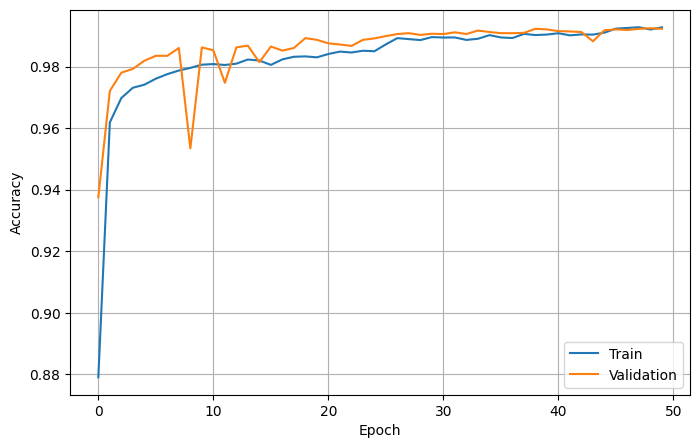

# NoTouchTyping

NoTouchTyping is a browser-based application that translates fingerspelled sign language into text in real time, using your webcam — no keyboard required. Hold a sign steady, and the system predicts the corresponding letter, builds it into words, and types it out automatically.

**Live demo:** https://charan-0845.github.io/NoTouchTyping/

---

## Features

- Real-time sign-to-text translation via webcam
- Stabilized predictions — letters are only committed once a sign is held steady, reducing false positives
- Automatic spell-checking of completed words
- Audio playback of typed output
- Reference page for supported signs
- Lightweight, no installation required — runs entirely in the browser

---

## How It Works

1. The frontend captures webcam frames in the browser.
2. Frames are streamed to the backend over a WebSocket connection.
3. The backend runs a prediction model on each frame and returns the predicted letter.
4. The frontend stabilizes predictions over time, commits letters once confidence is high, and assembles them into words with live spell-checking.

---

## Project Structure

```
NoTouchTyping/
├── index.html          # Landing page
├── app.html             # Main sign-to-text application
├── reference.html        # Sign reference guide
├── about.html            # About page
├── styles.css
├── nav.js
├── app.js                # Frontend logic, WebSocket client
├── assets/                # Images, sign reference assets
└── backend/
    ├── main.py            # FastAPI app, WebSocket endpoint, prediction logic
    ├── Dockerfile
    └── ...
```

Frontend files are kept at the repository root (rather than in a `frontend/` subfolder) so they can be served directly by GitHub Pages, which only supports serving from `/` or `/docs`. The backend lives independently in `backend/` and is deployed separately.

---

## Live Deployment

| Component | Platform | URL |
|---|---|---|
| Frontend | GitHub Pages | https://charan-0845.github.io/NoTouchTyping/ |
| Backend  | Render (Docker) | https://notouchtyping.onrender.com |

The backend exposes:
- `GET /` — health check
- `WS /ws` — real-time prediction stream

### Updating the live site

- **Frontend:** any push to `main` is automatically reflected on GitHub Pages (may take a minute to propagate).
- **Backend:** any push to `main` triggers an automatic redeploy on Render.

### CORS

The backend only accepts cross-origin requests from `https://charan-0845.github.io`. If you fork this project and host your own frontend elsewhere, update `allow_origins` in `backend/main.py` to match your deployed origin.

---

## Running Locally

### Backend

```bash
cd backend
docker build -t notouchtyping-backend .
docker run -p 8000:8000 notouchtyping-backend
```

### Frontend

Serve the repo root with any static file server, e.g.:

```bash
npx serve .
```

Then update `BACKEND_WS_URL` in `app.js` to point at `ws://localhost:8000/ws` for local testing.

---

## Model Training

The sign recognition model is a multilayer perceptron (MLP) classifier trained on hand landmark coordinates extracted via MediaPipe (21 landmarks × 3 coordinates = 63 features per sample), rather than raw image pixels. This landmark-based approach keeps the model lightweight and fast enough for real-time inference in the browser-to-backend pipeline. Training code and the full pipeline are available in [`ASL_MLP_Training.ipynb`](ASL_MLP_Training.ipynb).

**Dataset**
- [ASL Alphabet](https://www.kaggle.com/datasets/grassknoted/asl-alphabet) (Kaggle, by grassknoted) — images of the American Sign Language alphabet across letter classes plus auxiliary classes such as `nothing`, `space`, and `del`.

**Data preparation**
- Hand landmarks were extracted from the dataset images using MediaPipe and compiled into a CSV (`landmarks.csv`), one row per sample, 63 landmark features plus a label column.
- The `nothing` class (no hand / no sign present) was removed from the dataset prior to training.
- Labels were encoded with `sklearn`'s `LabelEncoder` and saved to `label_encoder.pkl` for use at inference time.
- Data was split 80/20 into train and test sets (`train_test_split`, stratified by class, `random_state=42`).

**Architecture**

A fully-connected feedforward network (Keras `Sequential`):

| Layer | Output | Notes |
|---|---|---|
| Dense | 256 | ReLU |
| BatchNormalization + Dropout | — | Dropout 0.3 |
| Dense | 128 | ReLU |
| BatchNormalization + Dropout | — | Dropout 0.3 |
| Dense | 64 | ReLU |
| Dense | 28 | Softmax (output classes) |

- **Optimizer:** Adam (learning rate 0.001)
- **Loss:** Sparse categorical crossentropy
- **Framework:** TensorFlow / Keras

**Training configuration**
- Up to 100 epochs, batch size 128, with a further internal 80/20 train/validation split
- `EarlyStopping` (monitors `val_loss`, patience 10, restores best weights) to stop training once validation loss plateaus
- `ReduceLROnPlateau` (monitors `val_loss`, factor 0.5, patience 5) to lower the learning rate when progress stalls

The trained model is exported to `asl_mlp_model.keras`, alongside the corresponding `label_encoder.pkl`, for use by the backend at inference time.

### Training results



The model converges quickly, reaching ~98% validation accuracy within the first 10 epochs and stabilizing around ~99% train/validation accuracy by epoch 30. A brief validation dip occurs around epoch 8, but the model recovers and remains stable for the remainder of training, with train and validation accuracy tracking closely — indicating minimal overfitting. Early stopping and learning-rate reduction helped the model converge cleanly without further degradation.

---

## Tech Stack

- **Frontend:** HTML, CSS, vanilla JavaScript, WebSocket API
- **Backend:** Python, FastAPI, WebSockets
- **Model:** MLP classifier (TensorFlow/Keras) trained on MediaPipe hand landmark coordinates (63 features, 28 output classes)
- **Deployment:** GitHub Pages (frontend), Render (backend, via Docker)

---

## License

*(Add your license here, e.g. MIT)*

---

## Acknowledgements

- [ASL Alphabet dataset](https://www.kaggle.com/datasets/grassknoted/asl-alphabet) by grassknoted on Kaggle, used to train the sign recognition model.